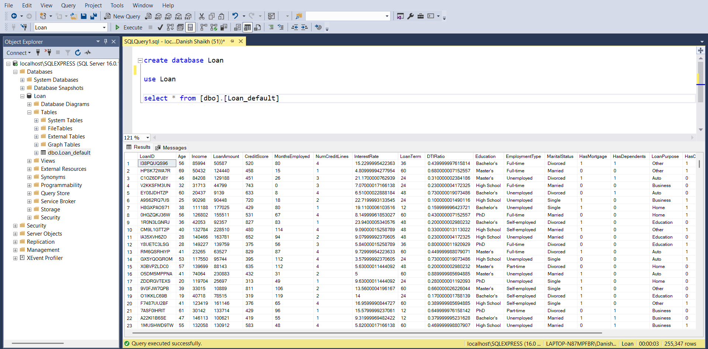
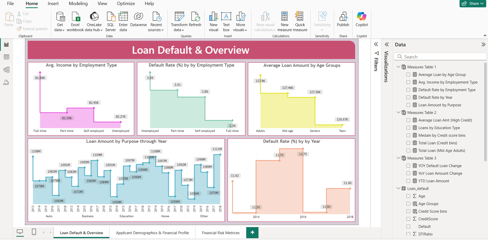

# 🏦 Loan Default & Risk Analysis Dashboard 📈

## 1. Overview
Designed and developed a comprehensive **Loan Default & Risk Analysis Power BI Dashboard** to quantify and visualize credit risk factors. The project's goal was to provide analysts and stakeholders with real-time, actionable insights to optimize lending strategies and mitigate financial risk.

---

## 🛠️ Tools & Technologies (The Advanced BI Stack)
* **Business Intelligence:** **Power BI (Desktop & Service)**
* **Data Modeling:** **DAX** (CALCULATE, SUMX, FILTER, AVERAGEX, MEDIANX, SWITCH, etc.)
* **Data Backend:** **SQL Server** (Data Source)
* **ETL & Automation:** **Power Query Editor**, Power BI **Dataflows**, Gateway (for Incremental & Scheduled Refresh)

### Data Source
* **Data:** Loan Default Dataset (Applicant demographics, loan details, and financial risk attributes).

---

## 2. ⚙️ Data Engineering & Automation (The ETL Pipeline)
This section highlights the technical depth of the data pipeline, proving expertise in data governance and automation beyond simple reporting.

* Installed & configured **SQL Server** and **Power BI Gateway**.
* Built a **Dataflow in Power BI Service** to centralize data preparation and logic.
* Configured **scheduled refresh & incremental refresh** for the dataflows to ensure real-time analytics.

****

---

## 3. 📊 Interactive Dashboard Structure (3 Report Pages)

### A. Page 1: Loan Default & Overview
*Focuses on overall portfolio health, income, default percentages, and trends over time.*

****

### B. Page 2: Applicant Demographics & Financial Profile
*Provides a detailed analysis of the borrower base segmented by credit score, marital status, and education.*

****
 

### C. Page 3: Financial Risk Metrics
*Presents complex metrics like YOY/YTD performance and uses advanced visuals like the Decomposition Tree to identify risk contributors.*

****

---

## 4. Advanced DAX & Analytical Process
* **Statistical Analysis:** Created measures for average income, average loan, and **Median loan by credit score bins (`MEDIANX`)**.
* **Risk Metrics:** Built custom measures for **Default rate analysis** by employment type and year.
* **Time Intelligence:** Implemented **Year-over-Year (YOY)** and **Year-to-Date (YTD)** loan performance analysis.

## 5. Key Achievements & Value Delivered
* **Automation:** Successfully implemented and managed an **automated refresh pipeline**, ensuring reports are always based on accurate, near-real-time data.
* **Technical Proficiency:** Demonstrated advanced mastery of **DAX modeling** and time intelligence.

## 6. View Project
* **Source File:** `Loan_Risk_Dashboard.pbix` (Available in this repository)
